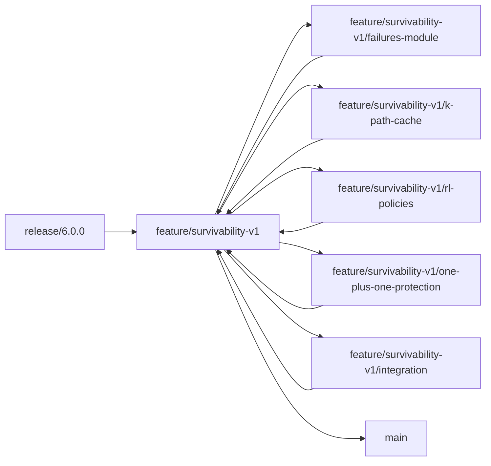

# Phase 1: Foundation & Setup

## 03 - Version Control & Branching Strategy

**Purpose**: Define Git workflow and branching strategy for survivability implementation.

---

## FUSION's Branching Pattern

Based on recent commits, FUSION uses a structured branching pattern:

```
<category>/<description>
```

### Categories

| Category | Purpose | Examples |
|----------|---------|----------|
| `feature/` | New features | `feature/grooming-port`, `feature/survivability-v1` |
| `refactor/` | Code refactoring | `refactor/docs`, `refactor/visualization`, `refactor/unit-tests` |
| `fix/` | Bug fixes | `fix/spectrum-allocation` |
| `docs/` | Documentation only | `docs/api-reference` |
| `test/` | Test improvements | `test/integration-suite` |
| `chore/` | Maintenance | `chore/dependencies-update` |

### Main Branches

- **`main`**: Stable production branch
- **`release/X.Y.Z`**: Release preparation branches (e.g., `release/6.0.0`)

---

## Recommended Workflow for Survivability v1

### Option 1: Single Feature Branch (Simpler)

**Recommended for small team or single developer**:

```bash
# Create main feature branch
git checkout -b feature/survivability-v1

# Implement all components on this branch
# Commit frequently with descriptive messages

# Merge to main when complete
git checkout main
git merge feature/survivability-v1
```

**Pros**:
- Simple to manage
- Good for incremental commits
- Easy to review as a single PR

**Cons**:
- Large PR may be hard to review
- No parallel work on sub-components

---

### Option 2: Feature Branch with Sub-Branches (Recommended)

**Recommended for team collaboration or parallel development**:

```bash
# 1. Create main feature branch from release/6.0.0
git checkout release/6.0.0
git checkout -b feature/survivability-v1

# 2. Create sub-branches for major components
git checkout -b feature/survivability-v1/failures-module
# Implement failures module...
git commit -am "feat(failures): implement FailureManager and failure types"
git commit -am "feat(failures): add F1/F3/F4 failure injection"
git commit -am "test(failures): add unit tests with 85% coverage"

# 3. Merge sub-branch to main feature branch
git checkout feature/survivability-v1
git merge feature/survivability-v1/failures-module

# 4. Repeat for other components
git checkout -b feature/survivability-v1/k-path-cache
# Implement K-path cache...
git checkout feature/survivability-v1
git merge feature/survivability-v1/k-path-cache

git checkout -b feature/survivability-v1/rl-policies
# Implement RL policies...
git checkout feature/survivability-v1
git merge feature/survivability-v1/rl-policies

git checkout -b feature/survivability-v1/one-plus-one-protection
# Implement 1+1 protection...
git checkout feature/survivability-v1
git merge feature/survivability-v1/one-plus-one-protection

# 5. Final merge to main
git checkout main
git merge feature/survivability-v1
```

**Sub-branches by Phase**:

```
feature/survivability-v1/                  # Main feature branch
├── failures-module                        # Phase 2
├── k-path-cache                          # Phase 2
├── configuration                         # Phase 2
├── one-plus-one-protection               # Phase 3
├── recovery-timing                       # Phase 3
├── rl-policies                           # Phase 4
├── dataset-logging                       # Phase 4
├── metrics-reporting                     # Phase 5
└── integration                           # Phases 2-5 integration
```

**Pros**:
- Enables parallel development
- Smaller, focused PRs for review
- Easy to revert individual components
- Clear separation of concerns

**Cons**:
- More branches to manage
- Potential merge conflicts

---

## Commit Message Format

Follow **Conventional Commits** format (used in FUSION):

```
<type>(<scope>): <subject>

<body>

<footer>
```

### Types

| Type | Description | Example |
|------|-------------|---------|
| `feat` | New feature | `feat(failures): add FailureManager class` |
| `fix` | Bug fix | `fix(rl-policies): correct action mask computation` |
| `docs` | Documentation | `docs(survivability): add usage examples` |
| `test` | Tests | `test(failures): add integration test for F4 failure` |
| `refactor` | Code refactoring | `refactor(k-path-cache): optimize path feature extraction` |
| `style` | Code style (formatting) | `style(failures): fix line lengths and spacing` |
| `chore` | Maintenance | `chore(deps): update torch to 2.0.1` |
| `perf` | Performance improvement | `perf(k-path-cache): reduce memory usage by 30%` |

### Scopes

| Scope | Module |
|-------|--------|
| `failures` | `fusion/modules/failures/` |
| `rl-policies` | `fusion/modules/rl/policies/` |
| `routing` | `fusion/modules/routing/` (for 1+1, K-path cache) |
| `dataset-logging` | `fusion/reporting/dataset_logger.py` |
| `statistics` | `fusion/reporting/statistics.py` |
| `config` | `fusion/configs/` |
| `core` | `fusion/core/` (properties, simulation, sdn_controller) |
| `survivability` | General survivability features |

### Example Commit Messages

**Good**:

```
feat(failures): add FailureManager class for network failure injection

Implement FailureManager to handle link, node, SRLG, and geographic
failures. Includes active failure tracking, path feasibility checks,
and repair scheduling.

- Add inject_failure() for F1/F3/F4 failures
- Add is_path_feasible() for routing validation
- Add repair_failures() for time-based recovery
- Integrate with NetworkX topology

Closes #123
```

```
test(rl-policies): add unit tests for BC policy inference

Add comprehensive test coverage for BCPolicy class:
- test_bc_policy_loads_model: Model loads from .pt file
- test_bc_policy_respects_action_mask: Masked actions not selected
- test_state_tensor_format: State dict converts correctly

Coverage: 87%
```

```
fix(k-path-cache): handle disconnected node pairs gracefully

Previously crashed when computing K paths for disconnected node pairs.
Now returns empty list and logs warning.

Fixes #145
```

**Bad**:

```
Update code
```

```
Fixed bug
```

```
WIP
```

---

## Pull Request Workflow

### Creating a Pull Request

1. **Push your branch**:
   ```bash
   git push -u origin feature/survivability-v1/failures-module
   ```

2. **Open PR on GitHub**:
   - Base: `feature/survivability-v1` (for sub-branches) or `main` (for main feature branch)
   - Title: Use conventional commit format
   - Description: Include:
     - Summary of changes
     - Related issues
     - Testing done
     - Checklist of acceptance criteria

3. **PR Template** (example):

```markdown
## Summary
Implements the Failures Module for v1 survivability support, including F1 (link), F3 (SRLG), and F4 (geographic) failure types.

## Changes
- [x] Add FailureManager class
- [x] Implement fail_link, fail_srlg, fail_geo functions
- [x] Integrate with SimulationEngine
- [x] Add configuration schema extensions
- [x] Add comprehensive unit tests (85% coverage)

## Related Issues
Closes #123

## Testing
- [x] Unit tests pass (`pytest fusion/modules/failures/tests/ -v`)
- [x] Coverage ≥ 80% (`pytest --cov=fusion.modules.failures`)
- [x] Integration test with SimulationEngine passes
- [x] No regressions in existing tests

## Acceptance Criteria
- [x] test_link_failure_blocks_path
- [x] test_srlg_failure_multiple_links
- [x] test_geo_failure_radius
- [x] test_failure_repair_restores_path
- [x] test_failure_history_tracking

## Checklist
- [x] Code follows FUSION coding standards
- [x] All functions have type hints
- [x] All classes have Sphinx docstrings
- [x] README.md added to module
- [x] No files > 500 lines
- [x] No functions > 50 lines
```

### Code Review Checklist

Reviewers should verify:

- [ ] Follows FUSION coding standards (snake_case, type hints, docstrings)
- [ ] No files > 500 lines, no functions > 50 lines
- [ ] Test coverage ≥ 80%
- [ ] All acceptance tests pass
- [ ] No hardcoded paths (use pathlib + config)
- [ ] Specific exception handling (no bare `except`)
- [ ] Module README.md present
- [ ] Integrates cleanly with existing code
- [ ] No breaking changes to existing functionality

---

## Branching Timeline (13-17 Days)

### Week 1: Core Infrastructure (Days 1-5)

**Days 1-2**: Failures Module
```bash
git checkout -b feature/survivability-v1/failures-module
# Implement, test, merge
```

**Day 3**: K-Path Cache
```bash
git checkout -b feature/survivability-v1/k-path-cache
# Implement, test, merge
```

**Day 4**: Configuration & Determinism
```bash
git checkout -b feature/survivability-v1/configuration
# Implement, test, merge
```

**Day 5**: Buffer / catch-up

---

### Week 2: Protection & RL (Days 6-10)

**Days 6-7**: 1+1 Protection
```bash
git checkout -b feature/survivability-v1/one-plus-one-protection
# Implement, test, merge
```

**Days 8-9**: RL Policies
```bash
git checkout -b feature/survivability-v1/rl-policies
# Implement, test, merge
```

**Day 10**: Dataset Logging
```bash
git checkout -b feature/survivability-v1/dataset-logging
# Implement, test, merge
```

---

### Week 3: Metrics & Integration (Days 11-17)

**Day 11**: Metrics & Reporting
```bash
git checkout -b feature/survivability-v1/metrics-reporting
# Implement, test, merge
```

**Days 12-14**: Integration & Testing
```bash
git checkout -b feature/survivability-v1/integration
# Integrate all components
# End-to-end testing
# Fix integration issues
```

**Days 15-16**: Documentation & Polish
```bash
# Update all README.md files
# Ensure docstrings complete
# Finalize configuration templates
```

**Day 17**: Final Review & Merge
```bash
git checkout main
git merge feature/survivability-v1
```

---

## Conflict Resolution

If merge conflicts arise:

```bash
# Update your branch with latest changes
git checkout feature/survivability-v1
git pull origin main

# Resolve conflicts in your editor
# Test after resolving
pytest tests/ -v

# Commit resolution
git add .
git commit -m "chore: resolve merge conflicts with main"
```

---

## Tagging Releases

After merging to main:

```bash
# Tag the release
git tag -a v1.0.0-survivability -m "Release v1.0.0: Survivability Extensions"
git push origin v1.0.0-survivability
```

---

## Summary Workflow



---

## Git Commands Cheat Sheet

```bash
# Create feature branch
git checkout -b feature/survivability-v1

# Create sub-branch
git checkout -b feature/survivability-v1/failures-module

# Stage and commit
git add fusion/modules/failures/
git commit -m "feat(failures): add FailureManager class"

# Push branch
git push -u origin feature/survivability-v1/failures-module

# Merge sub-branch
git checkout feature/survivability-v1
git merge feature/survivability-v1/failures-module

# Update from remote
git pull origin feature/survivability-v1

# View branches
git branch -a

# Delete local branch (after merge)
git branch -d feature/survivability-v1/failures-module

# Delete remote branch
git push origin --delete feature/survivability-v1/failures-module
```

---

## Next Steps

After understanding version control:

1. **Proceed** to **Phase 2** ([10-failure-module.md](../phase2-infrastructure/10-failure-module.md))
2. **Create** your feature branch: `git checkout -b feature/survivability-v1`
3. **Start** implementing the Failures Module

---

**Related Documents**:
- [00-overview.md](00-overview.md) (Project context)
- [60-work-breakdown.md](../phase7-management/60-work-breakdown.md) (Timeline details)
- FUSION [DEVELOPMENT_WORKFLOW.md](../../../DEVELOPMENT_WORKFLOW.md)
